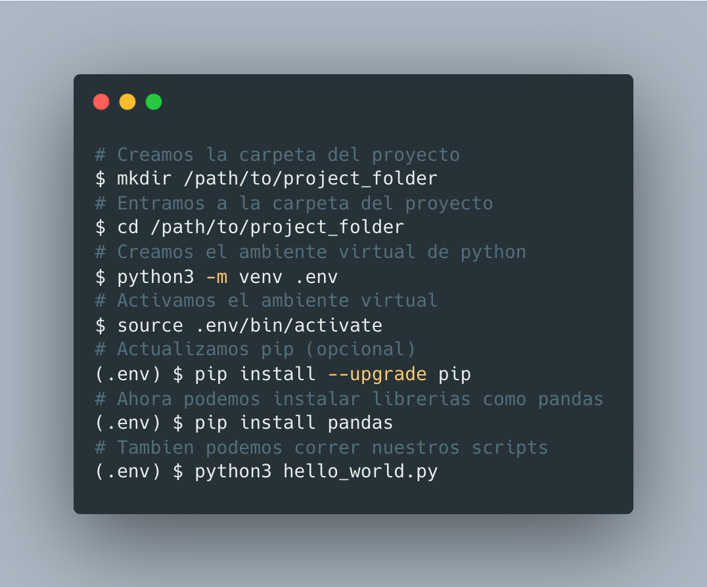
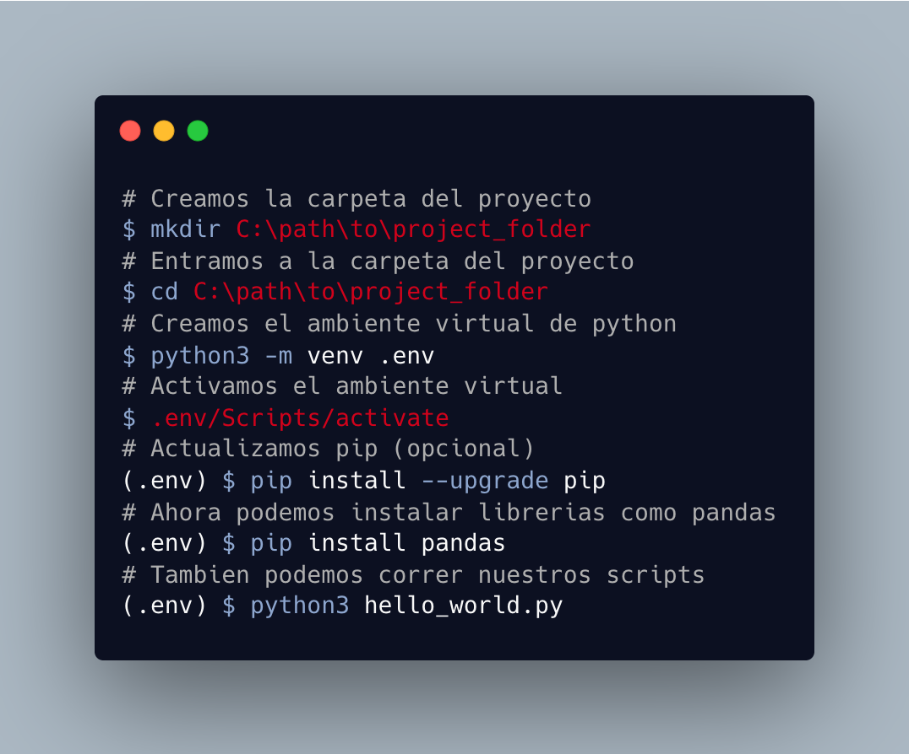

# Ejercicio 1: Configura tu ambiente de Python para Data Science

Pasos a seguir:

> Pre-requisito: Tener instalado Python

1. Crea la carpeta donde guardarás tu proyecto (1 pto)
2. Crea un ambiente virtual para tu proyecto (4 ptos)

Si tienes un OS Linux/MacOS:


Si tienes un OS Windows


3. Instala las librerías básicas de ciencia de datos (10 ptos)
```sh
$ pip install numpy pandas matplotlib jupyter
```

4. Crea tu primer notebook de jupyter para exploración de datos (5 ptos)
```sh
$ jupyter notebook
```
Se abrirá una pestaña en tu navegador con el siguiente programa:

)

> Hint: Los comandos se utilizan sin el simbolo "$"
